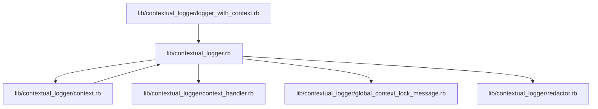

# Lib Contextual Logger

## Purpose

<!-- adlc:preserve:BEGIN purpose-lib-contextual-logger -->
<!-- adlc:pending section="purpose" -->
_Not yet documented._ See [Architecture Doc Generation Provenance](https://github.com/Invoca/ADLC/blob/main/adlc/capabilities/architecture-doc-pipeline/docs/architecture-doc-generation-provenance.md) for what generation derives automatically vs. what requires investigation.
<!-- /adlc:pending -->
<!-- adlc:preserve:END purpose-lib-contextual-logger -->

---

## Anchor Files

- `lib/contextual_logger.rb` — <!-- adlc:preserve:BEGIN anchor-file-lib-contextual-logger-lib_contextual_logger_rb -->
  <!-- adlc:pending section="anchor-file-lib-contextual-logger-lib_contextual_logger_rb" -->
  _Not yet documented._ See [Architecture Doc Generation Provenance](https://github.com/Invoca/ADLC/blob/main/adlc/capabilities/architecture-doc-pipeline/docs/architecture-doc-generation-provenance.md) for what generation derives automatically vs. what requires investigation.
  <!-- /adlc:pending -->
  <!-- adlc:preserve:END anchor-file-lib-contextual-logger-lib_contextual_logger_rb -->
- `lib/contextual_logger/context.rb` — <!-- adlc:preserve:BEGIN anchor-file-lib-contextual-logger-lib_contextual_logger_context_rb -->
  <!-- adlc:pending section="anchor-file-lib-contextual-logger-lib_contextual_logger_context_rb" -->
  _Not yet documented._ See [Architecture Doc Generation Provenance](https://github.com/Invoca/ADLC/blob/main/adlc/capabilities/architecture-doc-pipeline/docs/architecture-doc-generation-provenance.md) for what generation derives automatically vs. what requires investigation.
  <!-- /adlc:pending -->
  <!-- adlc:preserve:END anchor-file-lib-contextual-logger-lib_contextual_logger_context_rb -->
- `lib/contextual_logger/context_handler.rb` — <!-- adlc:preserve:BEGIN anchor-file-lib-contextual-logger-lib_contextual_logger_context_handler_rb -->
  <!-- adlc:pending section="anchor-file-lib-contextual-logger-lib_contextual_logger_context_handler_rb" -->
  _Not yet documented._ See [Architecture Doc Generation Provenance](https://github.com/Invoca/ADLC/blob/main/adlc/capabilities/architecture-doc-pipeline/docs/architecture-doc-generation-provenance.md) for what generation derives automatically vs. what requires investigation.
  <!-- /adlc:pending -->
  <!-- adlc:preserve:END anchor-file-lib-contextual-logger-lib_contextual_logger_context_handler_rb -->

  ---

## File Membership

- `lib/contextual_logger.rb`
- `lib/contextual_logger/context.rb`
- `lib/contextual_logger/context_handler.rb`
- `lib/contextual_logger/global_context_lock_message.rb`
- `lib/contextual_logger/logger_with_context.rb`
- `lib/contextual_logger/redactor.rb`

**What belongs here**: every file under the project's source root(s) whose purpose fits this LEAF, per the ADLC framework's `subsystem-architecture.md` I1.

---

## Composition & Relationship Diagram

---

## Public Contract

<!-- adlc:preserve:BEGIN public-contract-lib-contextual-logger -->
<!-- adlc:pending section="public-contract" -->
_Not yet documented._ See [Architecture Doc Generation Provenance](https://github.com/Invoca/ADLC/blob/main/adlc/capabilities/architecture-doc-pipeline/docs/architecture-doc-generation-provenance.md) for what generation derives automatically vs. what requires investigation.
<!-- /adlc:pending -->
<!-- adlc:preserve:END public-contract-lib-contextual-logger -->

---

## Key Invariants

<!-- adlc:preserve:BEGIN key-invariants-lib-contextual-logger -->
<!-- adlc:pending section="key-invariants" -->
_Not yet documented._ See [Architecture Doc Generation Provenance](https://github.com/Invoca/ADLC/blob/main/adlc/capabilities/architecture-doc-pipeline/docs/architecture-doc-generation-provenance.md) for what generation derives automatically vs. what requires investigation.
<!-- /adlc:pending -->
<!-- adlc:preserve:END key-invariants-lib-contextual-logger -->

---

## Security Posture

<!-- adlc:preserve:BEGIN security-posture-lib-contextual-logger -->
<!-- adlc:pending section="security-posture" -->
_Not yet documented._ See [Architecture Doc Generation Provenance](https://github.com/Invoca/ADLC/blob/main/adlc/capabilities/architecture-doc-pipeline/docs/architecture-doc-generation-provenance.md) for what generation derives automatically vs. what requires investigation.
<!-- /adlc:pending -->
<!-- adlc:preserve:END security-posture-lib-contextual-logger -->

---

## State Owned

<!-- adlc:preserve:BEGIN state-owned-lib-contextual-logger -->
<!-- adlc:pending section="state-owned" -->
_Not yet documented._ See [Architecture Doc Generation Provenance](https://github.com/Invoca/ADLC/blob/main/adlc/capabilities/architecture-doc-pipeline/docs/architecture-doc-generation-provenance.md) for what generation derives automatically vs. what requires investigation.
<!-- /adlc:pending -->
<!-- adlc:preserve:END state-owned-lib-contextual-logger -->

---

## Dependencies

_Generation derived no declared dependencies for this LEAF._

<!-- adlc:preserve:BEGIN dependency-lib-contextual-logger-no-entries -->
<!-- adlc:pending section="dependency-lib-contextual-logger-no-entries" -->
_Not yet documented._ See [Architecture Doc Generation Provenance](https://github.com/Invoca/ADLC/blob/main/adlc/capabilities/architecture-doc-pipeline/docs/architecture-doc-generation-provenance.md) for what generation derives automatically vs. what requires investigation.
<!-- /adlc:pending -->
<!-- adlc:preserve:END dependency-lib-contextual-logger-no-entries -->

---

## Runtime Sequence Diagrams

<!-- adlc:preserve:BEGIN runtime-sequence-diagrams-lib-contextual-logger -->
<!-- adlc:pending section="runtime-sequence-diagrams" -->
_Not yet documented._ See [Architecture Doc Generation Provenance](https://github.com/Invoca/ADLC/blob/main/adlc/capabilities/architecture-doc-pipeline/docs/architecture-doc-generation-provenance.md) for what generation derives automatically vs. what requires investigation.
<!-- /adlc:pending -->
<!-- adlc:preserve:END runtime-sequence-diagrams-lib-contextual-logger -->

---

## Known Limitations

<!-- adlc:preserve:BEGIN known-limitations-lib-contextual-logger -->
<!-- adlc:pending section="known-limitations" -->
_Not yet documented._ See [Architecture Doc Generation Provenance](https://github.com/Invoca/ADLC/blob/main/adlc/capabilities/architecture-doc-pipeline/docs/architecture-doc-generation-provenance.md) for what generation derives automatically vs. what requires investigation.
<!-- /adlc:pending -->
<!-- adlc:preserve:END known-limitations-lib-contextual-logger -->

---

## Last Hardened

<!-- adlc:pending section="last-hardened" -->
_Not yet documented._ See [Architecture Doc Generation Provenance](https://github.com/Invoca/ADLC/blob/main/adlc/capabilities/architecture-doc-pipeline/docs/architecture-doc-generation-provenance.md) for what generation derives automatically vs. what requires investigation.
<!-- /adlc:pending -->

---

## Hardening History

| Date | Commit | Bugs Found | Bugs Fixed | Theatre Tests | Pyramid Migrations | Notes |
|------|--------|------------|------------|---------------|---------------------|-------|
| _none yet_ | | | | | | |
